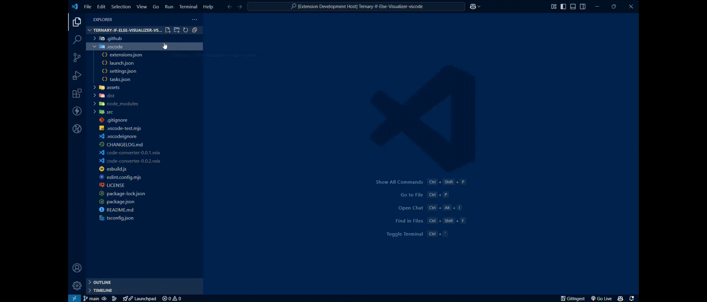
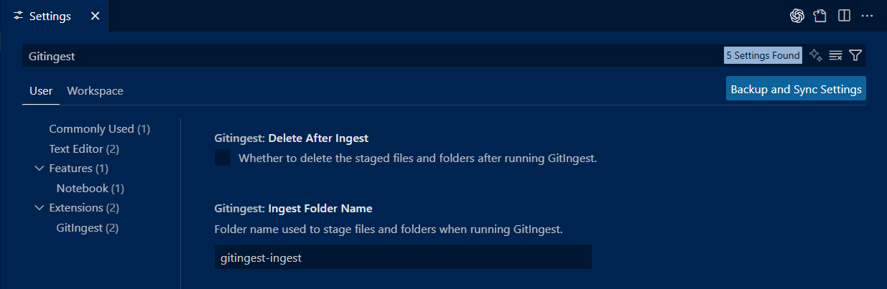

<div align="center">

  
  
_Deep insights, modern UI, and effortless integration into your workflow._

[](https://marketplace.visualstudio.com/items?itemName=iamshreydxv.gitingest)
[](https://marketplace.visualstudio.com/items?itemName=iamshreydxv.gitingest)
[](https://marketplace.visualstudio.com/items?itemName=iamshreydxv.gitingest)

</div>

---

## 📋 Table of Contents

- [🎯 What is GitIngest?](#what-is-gitingest)
- [✨ Key Features](#key-features)
- [🚀 Quick Start](#quick-start)
- [📖 Usage Guide](#usage-guide)
- [📊 Understanding Your Analysis](#understanding-your-analysis)
- [⚙️ Configuration & Settings](#configuration--settings)
- [❓ Troubleshooting](#troubleshooting)
- [🛡️ Privacy & Security](#privacy--security)
- [🤝 Contributing](#contributing)

---

## What is GitIngest?

GitIngest is a powerful code editor extension that provides **comprehensive codebase analysis** directly within your editor. Whether you're working with Git repositories or local folders, GitIngest helps you understand your project structure, analyze code patterns, and export insights—all without leaving your development environment.

### 🌟 Why Choose GitIngest?

<table>
<tr>
<td width="50%">

**🔧 Zero Setup Required**

- No CLI installation needed
- Everything runs within your editor
- Works offline with 100% local execution

</td>
<td width="50%">

**🌍 Universal Compatibility**

- Supports any codebase (Git or non-Git)
- Cross-platform (Windows, macOS, Linux)
- Smart filtering of unnecessary files

</td>
</tr>
</table>

---

## Key Features

<table>
<tr>
<td width="50%">

### 🎨 **Modern Interface**

- Beautiful three-panel webview layout
- Interactive directory tree visualization
- Real-time progress indicators
- Responsive design for all screen sizes
- One-click copy functionality

</td>
<td width="50%">

### 🔍 **Smart Analysis**

- Comprehensive codebase scanning
- Intelligent file filtering
- Summary insights and metrics
- Searchable and exportable results
- Custom folder selection

</td>
</tr>
<tr>
<td width="50%">

### ⚡ **Seamless Integration**

- Right-click context menus
- Command palette integration
- No external dependencies
- Instant results in webview

</td>
<td width="50%">

### 🛠 **Flexible Workflow**

- Analyze entire repositories
- Target specific folders
- Selective file inclusion
- Optional cleanup after analysis

</td>
</tr>
</table>

---

## Quick Start

### Prerequisites

Before getting started, ensure you have:

1. **VS Code 1.54.0 or higher**
2. **Python 3.x** installed and added to your system PATH

> 💡 **Quick Check**: Open a terminal and run `python --version` or `python3 --version` to verify installation

### Installation & First Analysis

1. **📦 Install the Extension**
    - Open Editor Extensions (Ctrl/Cmd + Shift + X)
    - Search for "GitIngest"
    - Click Install

2. **🎯 Analyze Your First Repository**
    - Open any project folder in your editor
    - Right-click on the folder in Explorer
    - Select **"GitIngest: Analyze This Folder"**
    - View results in the webview panel!

---

## Usage Guide

### Method 1: Quick Analysis (Recommended)

<details>
<summary><strong>🖱️ Right-Click Analysis</strong></summary>

**Perfect for immediate analysis of any folder**

1. Right-click on any folder in your editor Explorer
2. Choose **"GitIngest: Analyze This Folder"** for immediate analysis
3. View results in the automatically opened webview panel

</details>

<div align="center">
  
</div>

### Method 2: Selective Analysis (Advanced)

<details>
<summary><strong>🎯 Cherry-Pick Your Files</strong></summary>

**Ideal for large codebases where you only need specific parts analyzed**

1. Right-click on files/folders while holding Ctrl/Cmd
2. Select **"GitIngest: Add To Ingest"** for each item
3. Once you've selected all desired items, run the analysis
4. Optionally enable auto-cleanup in settings

</details>

<div align="center">
  
</div>

### Method 3: Command Palette

<details>
<summary><strong>⌨️ Keyboard-First Approach</strong></summary>

1. Press `Ctrl/Cmd + Shift + P` to open Command Palette
2. Type and select **"GitIngest: Analyze Repository"**
3. Follow the prompts and review your analysis

</details>

---

## Understanding Your Analysis

Your analysis results are presented in **three comprehensive panels**:

### 📋 Summary Panel

```
📈 Repository Overview
├── 📁 Files Analyzed: 156
├── 📊 Estimated Tokens: 12,450
├── 🗂️ Directory Structure
└── 📝 File Content Analysis
```

<div align="center">
  <strong>Export Options Available:</strong><br>
  
</div>

### 🌳 Directory Structure

Interactive tree view with smart filtering:

- ✅ Source code files included
- ❌ Build artifacts excluded
- ❌ Node_modules filtered out
- ❌ IDE-specific files hidden

### 📄 File Content Analysis

Detailed breakdown including:

- Code snippets and key functions
- Documentation and README files
- Configuration files
- Dependencies and imports

**Available Export Formats:**

- 📋 **Copy to Clipboard** - Quick sharing
- 💾 **Save as Text** - Local backup

---

## Configuration & Settings

<div align="center">
  
</div>

### Automatic Management

GitIngest handles these automatically:

- ✅ Python environment detection
- ✅ GitIngest package verification
- ✅ Platform-specific command execution
- ✅ Intelligent process management

### Customizable Options

Access via **File > Preferences > Settings > Extensions > GitIngest**:

- **File Exclusions** - Add custom patterns to ignore
- **Analysis Depth** - Control analysis scope
- **Auto Cleanup** - Enable/disable automatic staging cleanup
- **UI Preferences** - Customize panel layouts

---

## Troubleshooting

### Common Issues & Quick Fixes

<details>
<summary><strong>🐍 Python Not Found Error</strong></summary>

**Problem:** Extension can't locate Python installation

**Quick Solutions:**

1. Install Python 3.x from [python.org](https://python.org)
2. Ensure "Add Python to PATH" is checked during installation
3. Restart your editor after installation
4. Test with `python --version` in terminal

**Platform-Specific Help:**

- **Windows:** Use "Add Python to PATH" option during installation
- **macOS:** Install via Homebrew: `brew install python3`
- **Linux:** Install via package manager: `sudo apt install python3`

</details>

<details>
<summary><strong>⚠️ Analysis Failing or Hanging</strong></summary>

**Problem:** Analysis starts but doesn't complete

**Solutions:**

1. Check file permissions - Ensure your editor can read project files
2. Close other Python processes - Free up system resources
3. Restart your editor - Clear any stuck processes
4. Try a smaller folder first - Test with a simple project

**For Large Repositories:**

- Use selective analysis instead of full repository scan
- Exclude large directories (node_modules, .git, build folders)
- Consider analyzing in smaller chunks

</details>

<details>
<summary><strong>🔧 Extension Not Loading</strong></summary>

**Problem:** GitIngest commands not appearing in Editor

**Solutions:**

1. Reload your editor - Use `Ctrl/Cmd + Shift + P > "Reload Window"`
2. Check extension status - Ensure it's enabled in your Extensions panel
3. Update your editor - Ensure you're using a compatible version
4. Reinstall extension - Remove and reinstall from marketplace

</details>

### Need More Help?

- 📝 Check the Developer Console: `Help > Toggle Developer Tools`
- 🐛 Report bugs on [GitHub Issues](https://github.com/ShreyPurohit/gitingest-vsextension/issues)
- 💬 Join discussions in our GitHub repository

---

## Privacy & Security

Your privacy and security are our top priorities:

### 🔒 100% Local Execution

- All analysis happens on your machine
- No code sent to external servers
- No internet connection required

### 🔐 Zero Data Collection

- We don't collect or store any of your code
- No telemetry or usage tracking
- Your intellectual property stays private

### 🛡️ Safe Operation

- Read-only analysis of your files
- No modifications to your codebase
- Optional cleanup features with user consent

---

## Contributing

### Ways to Help

- 🌟 **Star the repository** - Help others discover GitIngest
- 🐛 **Report bugs** - Help me improve the extension
- 💡 **Suggest features** - Share your ideas for new functionality
- 💡 **Connect with me** - [GitHub](https://github.com/ShreyPurohit/)

---

## 📜 License

This project is licensed under the **MIT License**. See the [LICENSE](LICENSE) file for complete details.

---

## 🙌 Acknowledgments

💙 [GitIngest](https://gitingest.org/) – Core engine.  
💙 **VS Code API** – Enabling smooth integration.

<p align="center">
  <strong>Made with ❤️ for developers worldwide.</strong>
</p>

> ⭐ If this extension helped you, please consider giving it a star on the [GitHub](https://github.com/ShreyPurohit/gitingest-vsextension/) and marketplace!
