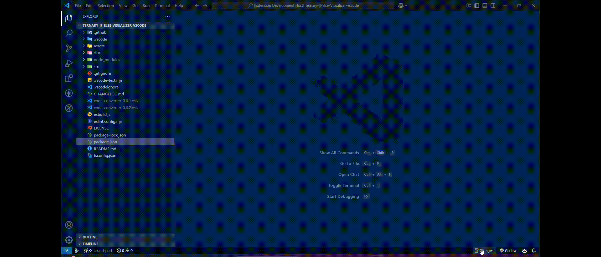
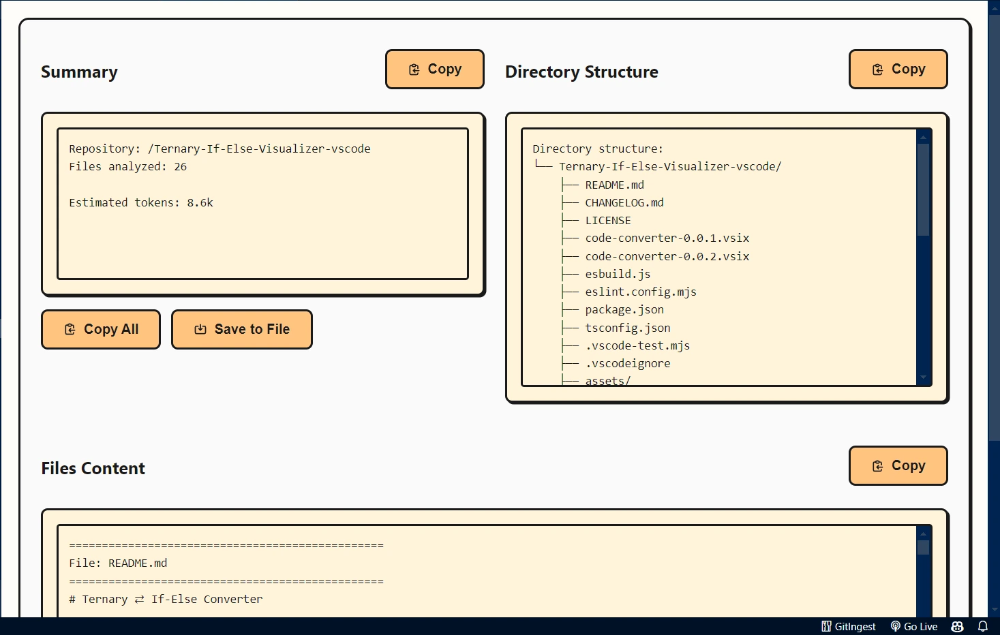
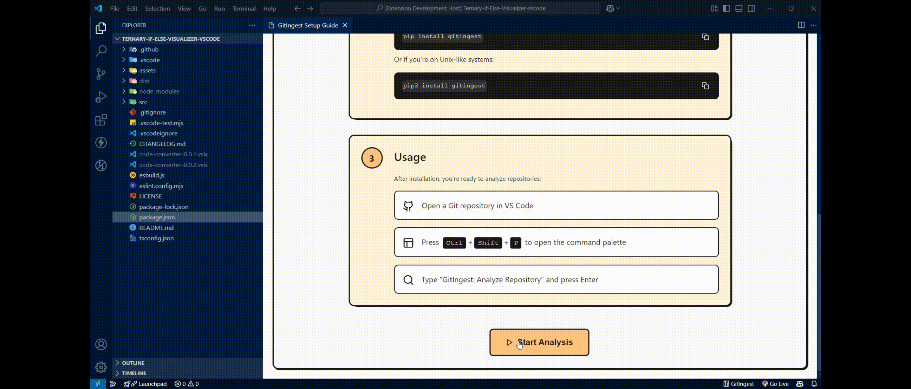

<h1 align="center">🚀 GitIngest VS Code Extension</h1>  

<p align="center">
  <a href="https://marketplace.visualstudio.com/items?itemName=iamshreydxv.gitingest">
    
  </a>
  <a href="https://img.shields.io/visual-studio-marketplace/d/iamshreydxv.gitingest?cacheSeconds=3600">
    
  </a>
  <a href="https://marketplace.visualstudio.com/items?itemName=iamshreydxv.gitingest">
    
  </a>
</p>

<p align="center">
  <strong>Seamlessly analyze your Git repositories inside VS Code!</strong>  
  <br>GitIngest provides deep insights, a modern UI, and effortless integration into your workflow.
</p>

<p align="center">
  
</p>

<hr style="border: 2px solid black; width: 100%;" />

## ✨ Features at a Glance  

### 🎯 **Modern & Interactive UI**  

✅ Beautiful Webview interface with a sleek design.  
✅ Interactive three-panel layout (Summary, Directory, File Content).  
✅ One-click copy for all analysis sections.  
✅ Real-time progress indicators.  
✅ Fully responsive design, adapts to different screen sizes.  

### 🛠 **Smart & Comprehensive Analysis**  

✅ Scans your entire repository with automatic filtering.  
✅ Excludes unnecessary files (build artifacts, binaries, IDE-specific files).  
✅ Displays repository insights in an easy-to-read format.  
✅ Searchable, copyable, and exportable results.  

### 🔄 **Seamless VS Code Integration**  

✅ Status Bar shortcut for quick access.  
✅ Command Palette support ( `Ctrl/Cmd + Shift + P` ).  
✅ Works across Windows, macOS, and Linux.  

<hr style="border: 2px solid black; width: 100%;" />

## 🏗️ Installation & Setup  

### 🔹 Prerequisites  

1. **Python 3.x** (Ensure it's added to system PATH)  
2. **VS Code 1.60.0 or higher**  
3. **A Git Repository**  

### 🔹 Install the Extension  

1. Install from the <a href="https://marketplace.visualstudio.com/items?itemName=iamshreydxv.gitingest">VS Code Marketplace</a>.  
2. Install required Python dependencies:  

```bash
pip install gitingest
# or
pip3 install gitingest
```

<hr style="border: 2px solid black; width: 100%;" />

## 🚀 How to Use

### Open a local codebase 

### Start GitIngest  

**Via Status Bar:** Click the GitIngest icon for one-click access. 

<br>

**Via Command Palette (`Ctrl/Cmd + Shift + P`)**  

  + Run **`GitIngest: Analyze Repository`** to start analysis.  
  + Run **`GitIngest: Show Setup Guide`** for setup help.  

  

<hr style="border: 2px solid black; width: 100%;" />

## 📊 Analysis Breakdown  

### **Summary Panel**  

* High-level repository overview.  
* Key insights and metrics.  
* Easily copyable format.  

### **Directory Structure**  

* Tree view of your project structure.  
* Filters out unnecessary files.  

### **File Content Analysis**  

* Highlights key file content.  
* Searchable, structured, and copyable.  

<p align="center">
  <strong>Save or export analysis data effortlessly:</strong><br>
  
</p>

<hr style="border: 2px solid black; width: 100%;" />

## ⚙️ Configuration  

GitIngest automatically manages:  
✔ **Python environment detection**  
✔ **GitIngest package verification**  
✔ **Platform-specific command execution**  
✔ **Intelligent process management**  

<hr style="border: 2px solid black; width: 100%;" />

## 🛡️ Security  

✅ **100% Local Execution** – No external API calls, everything runs on your machine.  
✅ **No Data Collection** – Your data stays private.  

<hr style="border: 2px solid black; width: 100%;" />

## ❓ Troubleshooting  

### **Common Issues & Fixes**  

#### 🚧 **Python Not Found?**  

✔ Ensure Python is installed and added to system PATH.  
✔ Run **`GitIngest: Show Setup Guide`** in the command palette.  

#### 🚧 **GitIngest Not Installed?**  

✔ Run `pip install gitingest` .  
✔ Verify pip installation with `pip --version` .  

#### 🚧 **Analysis Failing?**  

✔ Ensure repository access is configured correctly.  
✔ Verify Python installation.  
✔ Check user permissions.  

<p align="center">
  
</p>

<hr style="border: 2px solid black; width: 100%;" />

## 📜 License  

This project is licensed under the **MIT License**. See the [LICENSE](LICENSE) file for details.  

<hr style="border: 2px solid black; width: 100%;" />

## 🙌 Acknowledgments  

💙 [GitIngest](https://github.com/cyclotruc/gitingest) – Core engine.  
💙 **VS Code API** – Enabling smooth integration.  

<hr style="border: 2px solid black; width: 100%;" />

<p align="center">
  <strong>Made with ❤️ for developers worldwide.</strong>
</p>
